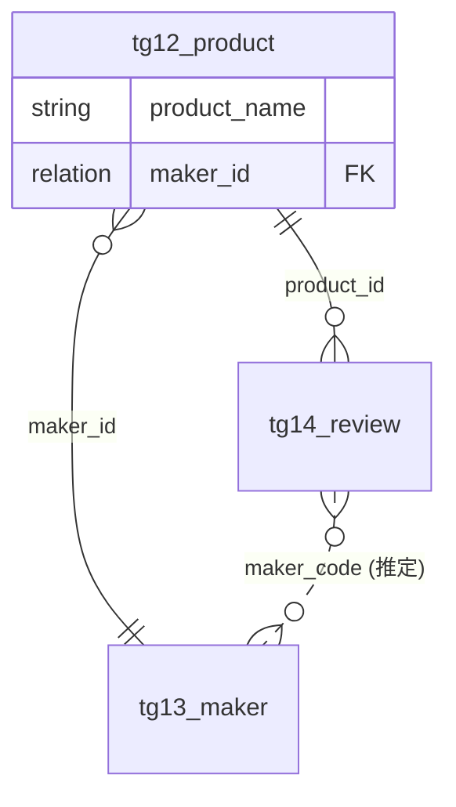
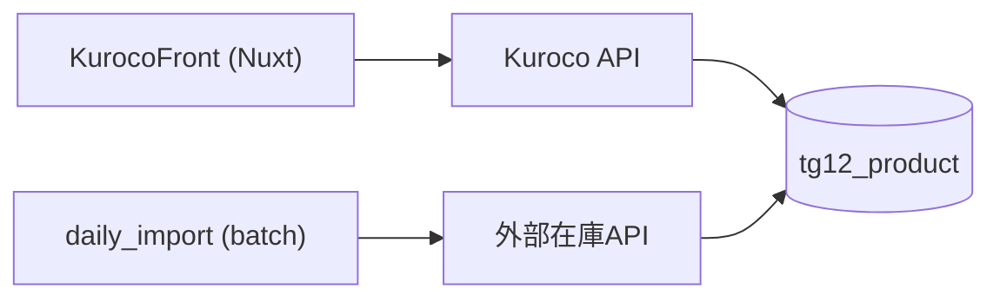
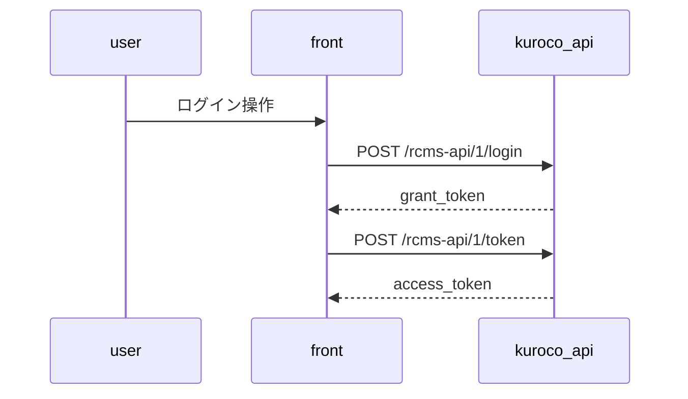
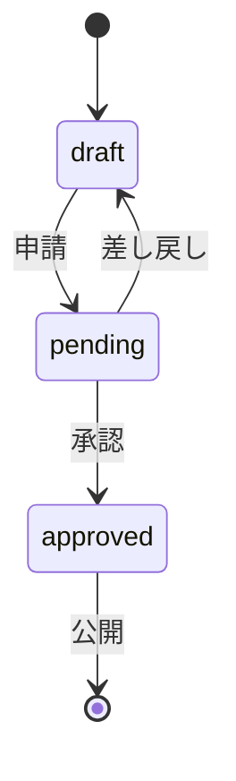

# Mermaid パターン集

仕様書で使う4種類の図の型と、構文エラー・可読性低下を招く落とし穴。
図が壊れていると仕様書全体の信頼が落ちるため、**ここにある型から外れる書き方をしない**。

## 全図共通のルール

- **図中の識別子はASCIIのみ**（`ext_slug`・エンドポイントパス・英語の状態名）。日本語はエッジラベル・状態遷移ラベルなどクォートできる場所に限って使う
- **ノードのラベルは常にダブルクォートで囲む**: `a["ラベル"]`。`()` `/` `:` `-` を含むラベルはクォートなしだと構文エラーになるため、含む含まないを判断せず常に囲む
- **1つの図のノード（エンティティ・状態・参加者）は12個まで**を目安にする。超えたら関心事で図を分割する（例: ER図をコア業務系とマスタ系に分ける）
- HTMLタグ（` ` 等）は使わない。GitHub と mermaid-cli で挙動が割れる
- コメント（`%%`）で図に注釈しない。説明は図の外の本文・表に書く

## erDiagram（contents/_index.md）

リレーション項目からER図を復元する。

- **エンティティ名 = ページキー**（`tg{topics_group_id}_{名前}`。コンテンツ定義に Kuroco 側の識別子は無いため仕様書側で採番する。決め方は SKILL.md）。日本語名は図に入れず、直下の対応表で示す
- **エッジラベル = リレーションを持つ側の `ext_slug`**。どの項目で繋がっているかが図から追える
- 多重度は項目定義から決める:
  - 単一リレーション・必須 → `}o--||`（多対1、参照先必須）
  - 単一リレーション・任意 → `}o--o|`
  - 繰り返しリレーション → `}o--o{`
  - 必須かどうか確定できない場合は `}o--o|` に寄せる（必須と断定しない）
- **リレーション項目を使わず、共通のコード項目（`request_no` 等）で定義間を紐付けている設計は珍しくない。**
  この場合は `--` ではなく `..`（破線）で描き、エッジラベルに `(推定)` を付ける。図の直下に
  「実線＝リレーション項目による確定、破線＝項目名の一致から推定」と1行書く。
  推定の根拠が項目名の一致だけなら、断定形の実線で描かない
- **実線/破線（確定か推定か）と多重度は独立に選ぶ。** 推定でも多重度が項目定義から読めるならそれを使う
  （必須のコード項目で1対多と読めるなら `||..o{`、根拠が弱ければ `}o..o{` に寄せる）
- **属性ブロックは任意**で、書く場合も主要項目とリレーション項目（`FK` を付ける）だけに絞る。全項目は各定義ページの項目表が正であり、ER図に全項目を書くと読めなくなる
- 属性の型は mermaid の予約に合わせて `string` / `int` / `date` / `relation` 程度の粗い分類でよい（正確な型は項目表に書く）
- リレーションが1本もないサイトではER図を作らず、一覧表のみにする（孤立エンティティを並べた図に情報量はない）

## flowchart（README 全体構成 / functions ページ）

- 方向は全体構成 = `LR`、処理フロー = `TD` を既定にする
- ノードIDに `.` `/` `-` を使わない（`api-list` はNG → `api_list`）。パスやURLはラベル側に書く
- 分岐は `{"条件?"}`、データストアは `[("名前")]`
- **分岐・並行・外部連携のない直列処理を図にしない**。3ステップの直列フローは文章で書く

## sequenceDiagram（auth.md / 外部連携）

- participant はASCII IDに `as` で短い表示名を付ける
- メッセージラベルにはメソッド+パスを書く（api.md と突き合わせられる）
- `alt` / `opt` は認証成否など仕様として意味のある分岐だけに使う。ハッピーパスを1本描くのが基本

## stateDiagram-v2（workflow.md）

- 状態名はASCII（`draft` / `pending` / `approved`）、遷移ラベルは日本語でよい
- **選択肢のキー自体が日本語のとき**（`未処理` / `承認` 等）は、状態名をローマ字化・英訳し、**図の直下に「状態名 / 実際のキー」の対応表を置く**。図の中に日本語キーを持ち込むと壊れ、対応表を省くと実装と突き合わせられなくなる
- 承認フローが多段の場合は `pending_step1` のように段数を状態名に含める
- 「差し戻し後にどの状態へ戻るか」は設定から確定できる場合のみ描く。確定できない遷移を推測で描かない（図は本文より「確定情報」として読まれる）

## よくある構文エラー

| 症状 | 原因 | 直し方 |
|------|------|--------|
| flowchart が丸ごと描画されない | ラベル内の `()` や `/` が未クォート | ラベルを常に `"..."` で囲む |
| erDiagram がエラー | エンティティ名に日本語・`-`・`.` | ページキー（`tg{topics_group_id}_{名前}`。ASCII 小文字, `_` 区切り）にする |
| エッジラベルの後が消える | ラベル内の `:` | ラベルをクォートする: `A --> B : "GET /path"` |
| stateDiagram で `end` という状態が作れない | `end` は予約語 | `done` 等に変える |
| GitHubでは表示されるがPDFで壊れる（またはその逆） | HTMLタグ・改行タグの利用 | ` ` 等を使わず、長いラベルは短くするかノードを分ける |

## レンダリング検証

- GitHub 上で確認するのが最速（push 前なら VS Code の Markdown プレビュー等）
- PDF 化時は `scripts/build-pdf.mjs` が実レンダリングで全図を検証し、失敗した図の**ファイル名と図番号**を報告する。エラーが出た図はこのファイルの型に照らして修正する
- Mermaid の `click` ディレクティブは GitHub でレンダリングされないため使わない。リンクは図の直下の表に置く
