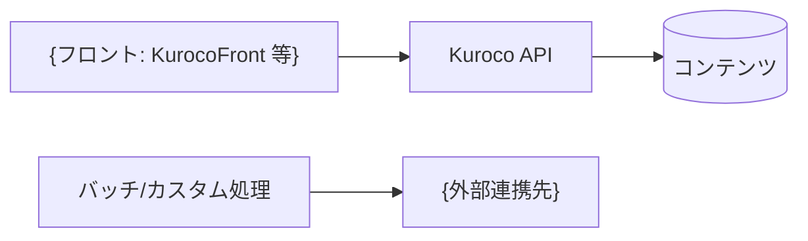
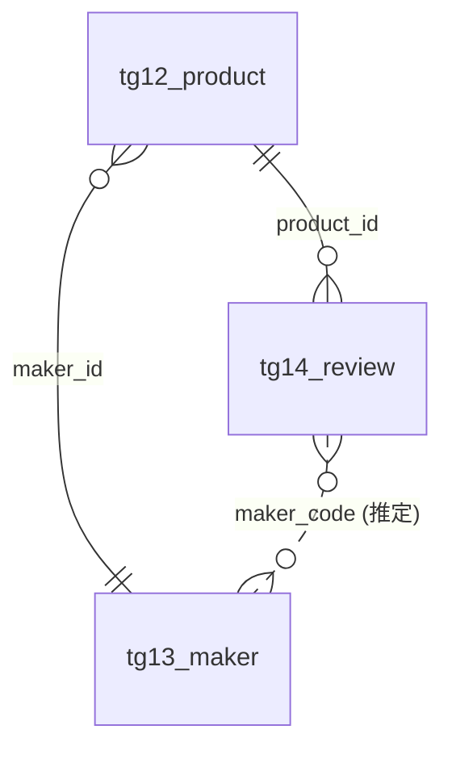
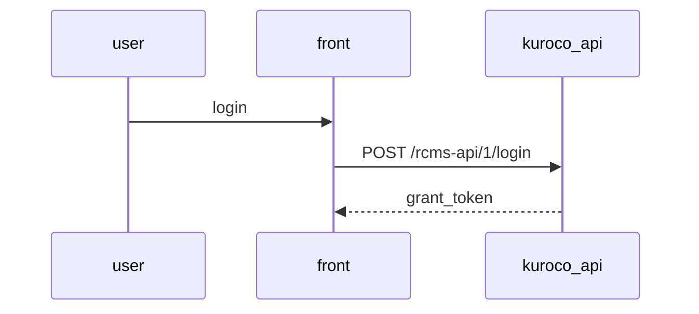
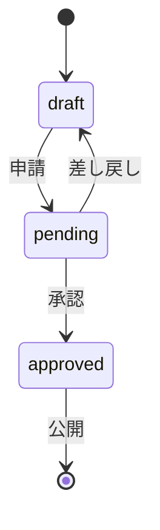
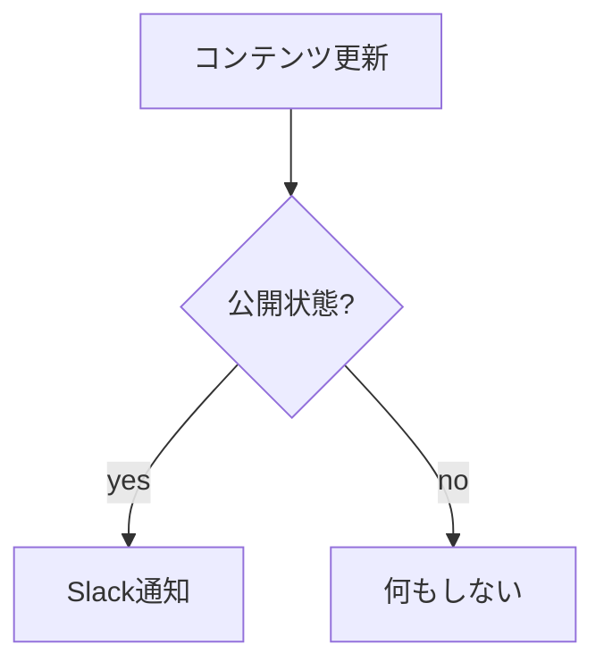

# 仕様書テンプレート

各ページの雛形。`{...}` は実値に置き換える。「(開発者向けのみ)」の行は非エンジニア向け詳細度では省く。
セクション自体が対象サイトに存在しない場合（例: カテゴリ未使用）はセクションごと削る——「なし」と書く価値がある箇所（承認フロー・閲覧制限）は雛形に明記してある。

**メタデータコメント（全ページ必須）**: 各ページの先頭に、反映時のID解決用コメントを置く。
HTMLコメントなので GitHub・PDF のどちらにも表示されず、詳細度設定に関わらず必ず入れる
（この仕様書を編集してAIに反映させる往復運用——[apply-changes.md](apply-changes.md)——の前提になる）。

```markdown
<!-- kuroco-spec: {"site_key":"sample-site","resource":"topics_group","id":12,"generated_at":"2026-08-21","tools":["topics_group-get","topics_category-list"]} -->
```

- `resource` / `id`: そのページが写しているリソースの種別と主キー（例: `topics_group`/`topics_group_id`、`api`/`api_id`、README は `resource:"site"` で `id` なし）
- 1ページに複数リソースが載る一覧ページ（`_index.md`・api.md 等）は `id` を配列にするか省略し、表内の識別子で解決する
- `tools`: **そのページを書くために実際に呼んだ読み取りツール名**をそのまま並べる。反映時の現況再取得で「どのツールを呼べばいいか」が自明になる
  （[apply-changes.md](apply-changes.md) の Step B）。推測した名前・呼んでいないツール・書き込みツールは入れない

**出典行（各ページ末尾・全詳細度で必須）**: どこを見れば原本があるかが分かり、再生成・レビューの起点になる。
**詳細度で変えるのは表現だけで、省略はしない**（メタデータコメントは機械可読、出典行は人間可読という別の役目を持つ）。

```markdown
（開発者向け）
> 出典: Admin MCP `topics_group-get`（topics_group_id=15） / `topics_category-list`（2026-08-21 取得）

（非エンジニア向け）
> この章は Kuroco 管理画面の「コンテンツ定義（ProcureFlow 購買申請）」の設定を 2026-08-21 に読み取って作成しました。
```

- ツール名は**実際に呼んだ名前**を書く。ツール名はサイト・接続スコープによって見える範囲が変わるため、一般名を書かない
- 反映（書き込み）に使うツール名は書かない。生成時に呼んでいないので裏取りがなく、反映時に一覧から引くのが正しい

---

## README.md（入口）

````markdown
<!-- kuroco-spec: {"site_key":"{site_key}","resource":"site","generated_at":"{YYYY-MM-DD}","tools":["whoami","site_setting-get"]} -->
# {サイト名} 仕様書

- 対象サイト: {site_key}（{env}） / {site_url}
- API: {api_url}
- 生成日: {YYYY-MM-DD}（Admin MCP による実設定の読み取り結果）
- 詳細度: 開発者向け | 非エンジニア向け

> 前提（未確認）: {非対話実行で仮定した項目。なければこの行ごと削る}

## 全体構成



## 目次

| 章 | 内容 |
|----|------|
| [コンテンツ定義](contents/_index.md) | {N}定義。ER図あり |
| [API](api.md) | {N}API・{N}エンドポイント |
| [認証・会員グループ](auth.md) | {方式の一言要約} |
| [承認ワークフロー](workflow.md) | {N}フロー（未使用なら行ごと「未使用」） |
| [カスタム処理・バッチ](functions/_index.md) | {N}件 |
| [フォーム](forms.md) | {N}フォーム（未使用なら「未使用」） |
| {使われている他モジュールの行を足す} | {N}件 |
| `schema/`（機械可読な定義） | OpenAPI {N}件 / コンテンツ定義 {N}件。読み物ではなく原本 |

## この仕様書の生成条件（開発者向けのみ）

| 項目 | 値 |
|------|-----|
| 取得方法 | Kuroco Admin MCP の読み取りツール |
| 接続スコープ | {`mcp:tools.read` / `/x/all/readonly` 等、whoami の permissions.connection から} |
| 実行者 | {whoami の member 名 or ロール。個人名を出したくない場合は「管理権限のアカウント」} |
| 呼んだツール | {章ごとに実際に呼んだツール名。各ページの出典行の集合} |
| 対象外 | 実データ（コンテンツ・会員）、ログ・分析、フロントエンド実装コード |

再生成するときは同じツール群を呼べば同じ章立てになる。**ツールが見えるかは接続スコープに依存する**ため、
スコープが違うと「未確認」の範囲が変わる。

## 未確認の項目

{取得できなかった章・項目と理由。なければ「なし」}

## この仕様書の編集について

この仕様書は生成日時点の実設定の写しです。編集してAIに「仕様書どおりに反映して」と
依頼できます。その際のルール:

- 識別子（ext_slug・エンドポイントパス・group_id）は変更しない。名前を変えたい場合は
  `new_slug（旧: old_slug）` のように旧名を併記する
- 表への行追加は「新規作成」、行削除は「削除の提案」として扱われ、削除は反映時に必ず個別確認されます
- 選択肢は `` `キー`: ラベル `` 形式です。ラベルだけ書き換えると表示名の変更、キーを変えると
  別の選択肢の追加・削除として扱われます
- 件数・生成日・各種ID・ページキー（ファイル名）は参考値で、編集しても反映されません
- `schema/` の JSON は生成時の読み取り結果そのものです。**編集しても反映されません**（反映の入力は
  Markdown 側。JSON は生成時点のスナップショットとして差分の基準に使います）
````

---

## contents/_index.md（コンテンツ定義一覧 + ER図)

````markdown
<!-- kuroco-spec: {"site_key":"{site_key}","resource":"topics_group","generated_at":"{YYYY-MM-DD}","tools":["topics_group-list","csvtable-list"]} -->
# コンテンツ定義

## ER図



実線はリレーション項目による確定、破線は項目名の一致から推定した紐付け。

## 定義一覧

ページキーは `tg{topics_group_id}_{名前}` 形式で、**名前部分はこの仕様書内でページと図のノードを指すための
便宜的な名前**（Kuroco 側の設定ではない）。実体を指すのは先頭の `topics_group_id`。

| ページキー | topics_group_id | 名称 | 件数 | ページ |
|-----------|----------------|------|------|--------|
| tg12_product | 12 | 商品 | {totalCnt} | [tg12_product.md](tg12_product.md) |
| tg13_maker | 13 | メーカー | {totalCnt} | [tg13_maker.md](tg13_maker.md) |

## 定義間の関係の要約

{ER図の読み方を2〜3文。例: 商品はメーカーに必ず属し、レビューは商品ごとに複数付く}

## CSVテーブル（マスタ）※使用時のみ

| csvtable_id | 名称 | 用途 | 参照している定義 |
|-------------|------|------|----------------|
````

ER図のルールは [mermaid-patterns.md](mermaid-patterns.md) を参照（ノード名はページキー・属性は主要項目とリレーションのみ）。

---

## contents/{ページキー}.md（1定義 = 1ページ）

````markdown
<!-- kuroco-spec: {"site_key":"{site_key}","resource":"topics_group","id":{topics_group_id},"generated_at":"{YYYY-MM-DD}","tools":["topics_group-get","topics_category-list"]} -->
# {日本語名}（{ページキー}）

{用途を業務の言葉で1〜2文。設定から確定できることだけ断定する}

- topics_group_id: {id}（開発者向けのみ）
- 件数: {totalCnt}

## 項目表

| 識別子 | 名称 | 型 | 必須 | 繰り返し | 選択肢 / 参照先 | 既定値 | 補足 |
|--------|------|----|------|----------|----------------|--------|------|
| product_name | 商品名 | テキスト | ○ | - | - | | |
| status | ステータス | セレクト | ○ | - | `draft`: 下書き / `open`: 公開 | `draft` | |
| maker_id | メーカー | リレーション | ○ | - | → [tg13_maker](tg13_maker.md) | | |
| images | 商品画像 | 画像 | - | 最大{n} | - | | |

### 明細（items）※繰り返し 最大20行

| 識別子 | 名称 | 型 | 必須 | 選択肢 / 参照先 | 既定値 | 補足 |
|--------|------|----|------|----------------|--------|------|
| item_name | 品名 | テキスト | ○ | - | | |

## 分類

- カテゴリ: {一覧 or 「未使用」}
- タグ: {使用タグカテゴリ or 「未使用」}

## 公開制御・状態

- 閲覧できる会員グループ: {group_nm の一覧 or 「全体公開」}（`secure_level`）
- 登録・編集できる会員グループ: {group_nm の一覧}（`writer_groups`）
- 承認: {「{group_nm} の更新は承認後に公開」（→ [workflow.md](../workflow.md)） or 「なし（直接公開）」}
- 自分の投稿のみ: {対象グループ or 「制限なし」}
- 公開APIへの露出: {「あり」 or 「なし（内部向け）」}
- 日時公開: {使用/未使用}

## 関連API

| メソッド | パス | 用途 |
|----------|------|------|
| GET | /rcms-api/1/products | 一覧取得（→ [api.md](../api.md)） |

> 機械可読な定義: `schema/contents/{ページキー}.json`（`topics_group-get` のレスポンス）
> 出典: Admin MCP `topics_group-get`（topics_group_id={id}） / `topics_category-list`（{YYYY-MM-DD} 取得）
````

- 項目表は**拡張項目を全件**載せる（ER図と逆の分担）。基本項目（`subject` / `slug` / `ymd` / `contents_type` / `contents`）は
  全定義に共通なので表には並べず、**その定義で何を表しているか（例: `subject` = 申請番号の表示名）と使用/未使用だけ**を項目表の直前に1〜2行で書く
- **識別子列を空にしない。** `ext_slug` が未設定の項目は `ext_1` 等のスロット名を書く（反映時にこれで解決する）
- **繰り返しグループは小見出しで区切り、グループ識別子と最大行数を見出しに書く**（`ext_parent_slug` / `ext_group_loop`）
- 選択肢は `` `キー`: ラベル `` の形で書く。キーがAPIに出る値であり、これを落とすと反映時に復元できない
- 型は日本語の型名にする（`type_N` の数値をそのまま書かない）
- 「補足」列には制約・検索対象（`searchable`）・意図（例: 申請中データは一覧に出ない）を書く。空でよい

---

## api.md（API一覧）

````markdown
<!-- kuroco-spec: {"site_key":"{site_key}","resource":"api","generated_at":"{YYYY-MM-DD}","tools":["api-list","api_uri-list"]} -->
# API

| api_id | API | 認証方式 | エンドポイント数 | 許可オリジン | 用途 |
|--------|-----|---------|----------------|-------------|------|
| 1 | frontend | Cookie | {n} | {cors.origins} | 会員向け画面 |

## エンドポイント一覧

### {API名}（{認証方式}）

| メソッド | パス | モデル/オペレーション | 対象 | キャッシュ | 状態 | 用途 |
|----------|------|----------------------|------|-----------|------|------|
| GET | /rcms-api/1/products | Topics::list | [tg12_product](contents/tg12_product.md) | {秒 or なし} | 有効 | 一覧取得 |

> 機械可読な定義: `schema/openapi/api{api_id}_{api名}.json`（`api-export_openapi` / OpenAPI 3.1.0）
> 出典: Admin MCP `api-list` / `api_uri-list` / `api-export_openapi`（{YYYY-MM-DD} 取得）
````

- 認証方式は `config.security` を日本語ラベルに訳す（`none`=無し / `static_token`=静的アクセストークン / `dynamic_token`=動的アクセストークン / `cookie`=Cookie / `privileged_static_token`=特権付き静的トークン。ラベルは `api-list` の `api_config_vectors.security.options` が正）
- パスは `/rcms-api/{api_id}/{api_uri}`。「対象」は `model_method_params.topics_group_id` から引いて定義ページへリンクする
- キャッシュは `cache_settings` の `maxage`（`{}` や `0` は「なし」）、「状態」は `open_flg`（`0` は無効なエンドポイント）
- 「用途」は `summary` を採用する（空なら model/対象から1行で書く）
- 認証方式・CORS などセキュリティ設定の**妥当性判定はしない**（それは security-audit の仕事）。事実として記載するだけ
- **パラメータ・レスポンススキーマは表に転記しない。** `schema/openapi/` の OpenAPI が原本で、この表は所在と用途の索引に徹する

---

## auth.md（認証・会員グループ）

````markdown
<!-- kuroco-spec: {"site_key":"{site_key}","resource":"group","generated_at":"{YYYY-MM-DD}","tools":["group-list","site_setting-get"]} -->
# 認証・会員グループ

## 認証方式

{Cookie / 動的トークン / 静的トークンのどれをどのAPIで使っているか}



## 会員グループ

| group_id | 名称 | 種別 | 所属人数 | 用途・権限の要約 |
|----------|------|------|---------|----------------|
| 1 | Administrator | 管理（特権） | {cnt} | 全モジュールの管理権限 |
| 104 | User | 会員 | {cnt} | フロントのログイン会員 |

- 種別は `super_flg`（`1`=特権グループ）と `group_kbn`（管理権限の設定値がある=管理系）から判定する
- 所属人数は `group-list` の `cnt`。**会員個人の名前・メールアドレスは書かない**

## 登録・ログインまわりの設定

{仮登録の有無、パスワードポリシー等。site_setting から確定できる範囲のみ}
````

---

## workflow.md（承認ワークフロー）

````markdown
<!-- kuroco-spec: {"site_key":"{site_key}","resource":"approvalflow","generated_at":"{YYYY-MM-DD}","tools":["approvalflow-list","approvalflow-get"]} -->
# 承認ワークフロー

## {フロー名}

- 適用先: {コンテンツ定義等へのリンク}
- 承認者: {グループ名。個人名は書かない}


````

---

## functions/_index.md と functions/{static_sysnm}.md

````markdown
<!-- kuroco-spec: {"site_key":"{site_key}","resource":"custom_function","generated_at":"{YYYY-MM-DD}","tools":["custom_function-list","batch-list"]} -->
# カスタム処理・バッチ

| 識別子 | 名称 | 種別 | トリガー | ページ |
|--------|------|------|---------|--------|
| notify_slack | Slack通知 | カスタム処理 | コンテンツ更新時 | [notify_slack.md](notify_slack.md) |
| daily_import | 日次取込 | バッチ | 毎日 03:00 | [daily_import.md](daily_import.md) |
````

````markdown
<!-- kuroco-spec: {"site_key":"{site_key}","resource":"custom_function","id":{static_id},"generated_at":"{YYYY-MM-DD}","tools":["custom_function-get"]} -->
# {名称}（{static_sysnm}）

- 種別: カスタム処理 | バッチ
- トリガー: {更新トリガー / cron / API内前後処理}
- 外部連携先: {Slack / 外部API 等 or 「なし」}

## 処理概要

{何を入力に、何をして、どこへ出すかを文章で。ソースコード全文は転載しない}


````

- flowchart は**分岐・並行・外部連携があるときだけ**。直列処理は文章のみ

---

## forms.md（フォーム）

````markdown
<!-- kuroco-spec: {"site_key":"{site_key}","resource":"inquiry","generated_at":"{YYYY-MM-DD}","tools":["inquiry-list","inquiry-get"]} -->
# フォーム

| フォームID | 名称 | 項目数 | 通知先 | 備考 |
|-----------|------|--------|--------|------|
````

フォーム数が多く項目定義まで必要な場合は contents/ と同様に `forms/{id}.md` へ分割してよい。

---

## schema/（機械可読な定義ファイル）

Markdown の各章とは別に、読み取った定義そのものを保存する。要約ではないので、移行・再現・機械的な差分の入力になる。
保存の条件とルールは SKILL.md の「機械可読な定義ファイルの保存」が正。

| パス | 中身 | 取得元 |
|------|------|-------|
| `schema/openapi/api{api_id}_{api名}.json` | OpenAPI 3.1.0 ドキュメント（`openapi_data` の中身） | `api-export_openapi`（`api_id` ごと） |
| `schema/contents/{ページキー}.json` | コンテンツ定義のレスポンス全体（`formData` を含む） | `topics_group-get`（定義ごと） |

- 各ページに書く参照行のパスは**出力先ディレクトリ（`spec/`）からの相対**で統一する（`schema/contents/...`。`../schema/...` と書き分けない）
- ファイル名の `{ページキー}` は Markdown 側のページ名と揃える（`contents/tg7_purchase_requests.md` ↔ `schema/contents/tg7_purchase_requests.json`）。ページキーは `tg{topics_group_id}_{名前}` 形式なので、定義ファイル単体でも実定義に辿り着ける
- `{api名}` は `api-list` の API 名を ASCII 小文字 + `_` に整えたもの。ページキーと同じ考え方で `api_id` を先頭に置く（`api1_frontend.json`）
- 加工しない。秘密情報だけ `"***"` に伏せ、伏せたキー名を参照元ページか README の注記に残す
- 取得できなかったものはファイルを作らず、対応するページに「未確認（理由）」と書く
